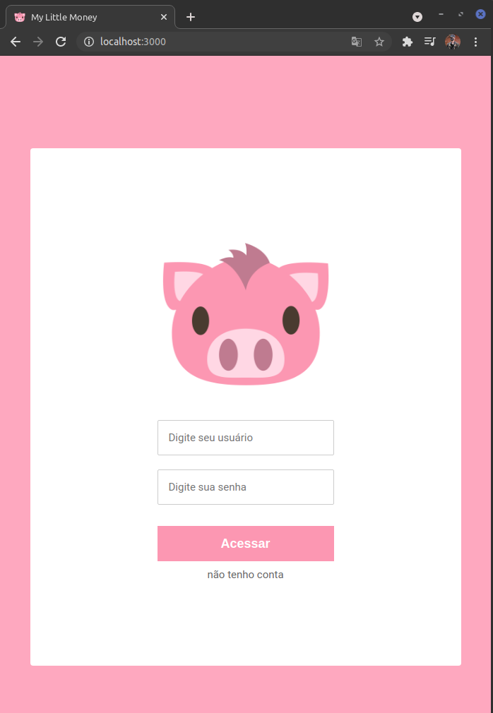
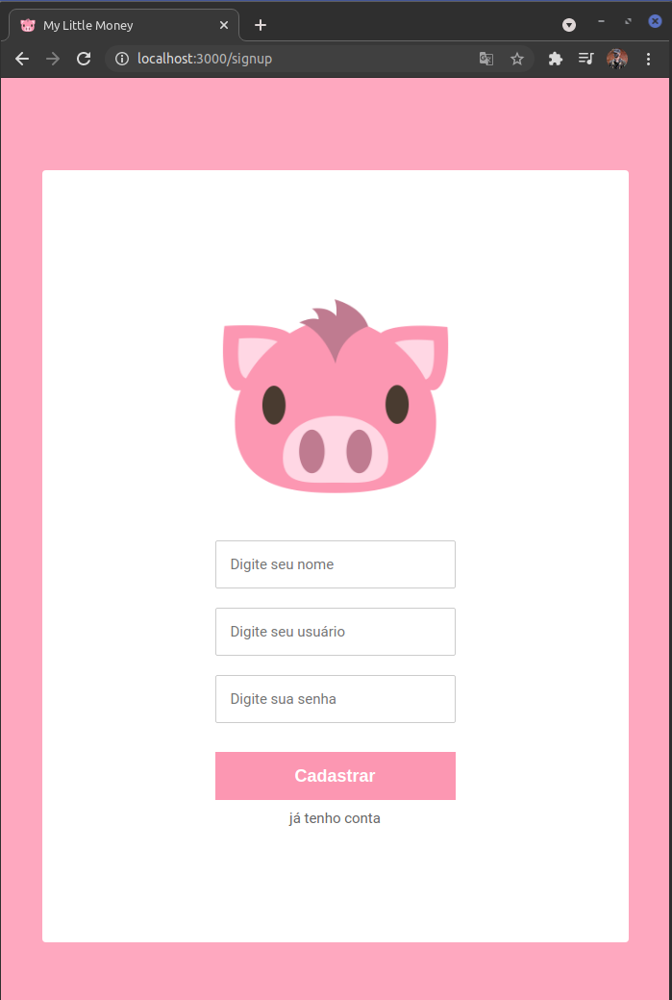
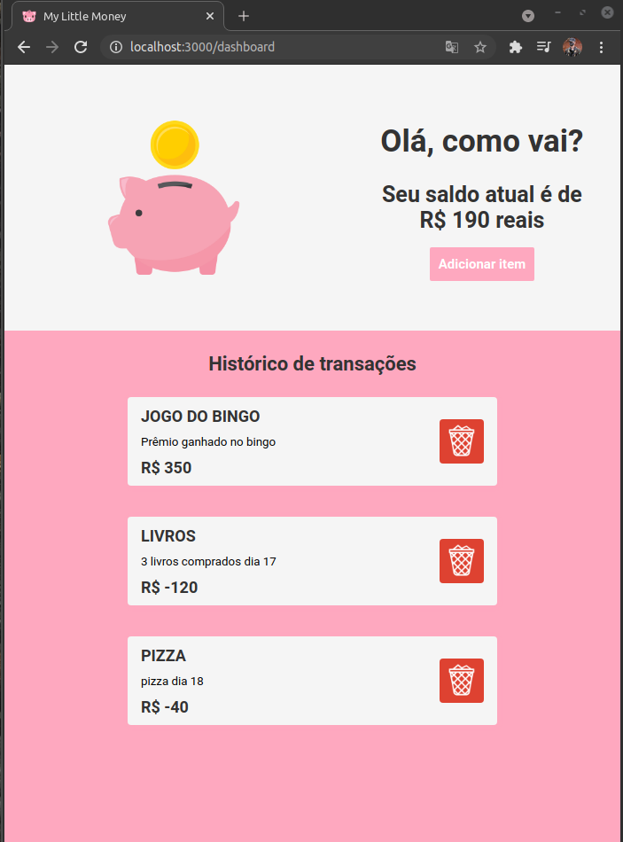
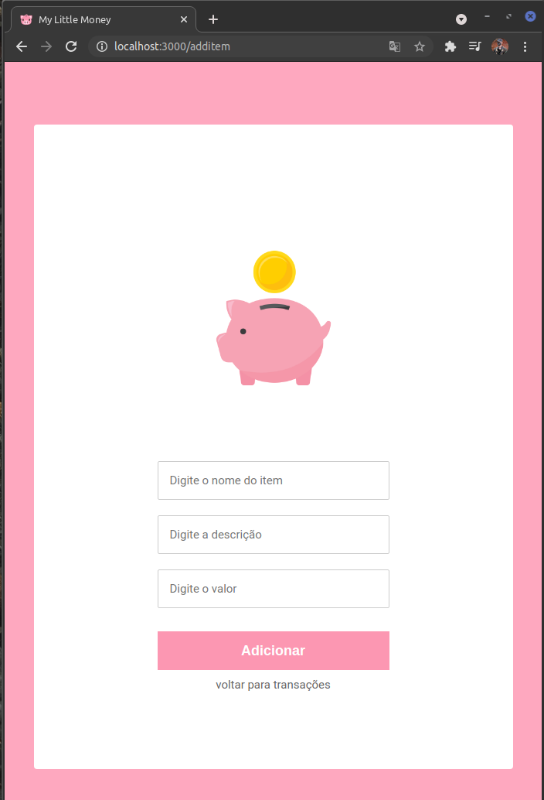

>## Rotas criadas:
-  1. POST /signin (Fazer login)
-  1. POST /signup (Criar uma nova conta)
-  1. GET /item (Listar todos items)
-  4. POST /item (Adiciona um novo item)
-  6. DELETE /item/{id} (Deleta um item)

>## Oque foi utilizado:
-  NodeJS + TypeScript 
-  MongoDB 
-  Clean Architecture
-  Husky 
-  Lint staged
-  Eslint
-  React
-  Hooks
-  React-router-dom
-  Redux
-  Redux-persist
-  Styled-components
-  History
-  Axios

>## Como executar:
-  git clone https://github.com/MatheusINFO/my-little-money.git
-  docker run --name clean-littlemoney -p 27017:27017 -d -t mongo
-  cd api
-  npm install
-  npm start
-  cd web
-  npm install
-  npm start

>## Telas criadas:

# Tela de login:

# Tela de cadastro:

# Tela de listagem:

# Tela de adicionar novo item:
